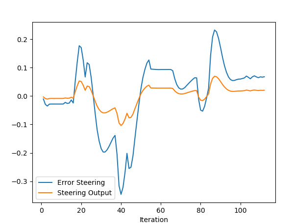

# Final Report

## 1. Affects of Different PID Parameters

### 1.1 Throttle PID Controller
The throttle PID controller is easy to tune. I simply disabled steer control PID controller, and only tuned throttle controller to maitain a given speed reference.

(1). Kp = 0.2, Ki = 0, Kd = 0

(2). Kp = 0.2, Ki=0.001, Kd = 0.0

(3). Kp = 0.2, Ki = 0.001, Kd = 0.2

### 1.2 Steer PID Controller
Here I fixed the parameters for throttling control as Kp = 0.2, Ki = 0.001, Kd = 0.2.
To tune the PID for steering control, I follow the same approach as tuning Throttle PID by tuning P, D, and I sequentially.

(1) Kp = 0.015, Ki = 0.0. Kd = 0.0

(2) Kp = 0.015, Ki = 0.0, Kd = 0.6

(3) kP = 0.015, Ki = 0.001, kD = 0.6

## 2. Other Questions

### 2.1 How would you design a way to automatically tune the PID parameters? This is an open question, the coherence and justification of the answer is valued.

There are many methods for automatically tuning the PID controller, such as Ziegler-Nichols tuning method, or optimization-based algorithms.
For optimization-based methods, we treat the PID coefficients as design variables, and search within a given range the optimal values to satisfy some predefined objectives such as minimizing oscillations or/and response time etc. 

### 2.2 PID controller is a model free controller, i.e. it does not use a model of the car. Could you explain the pros and cons of this type of controller? Find at least 2 pros and cons for model free versus model based.

Pros:

- model free method is simple in its format, and thus easy to implement in software
- due to the simplicity, model-free methods require less computational resources, thus can be applied for real-time applications.

Cons:
- model free methods cannot impose physical constraints on the controller, thus the control output may break the constraints of the control problem due to reactive characteristics
- model free methods such as PID are hard to tune in terms of parameters on field, epscially when multiple PIDs work in series/parallel.

### 2.3 (Optional) What would you do to improve the PID controller? This is an open question, the coherence and justification of the answer is valued.

The current tuning is not exhaustive due to time constraints and computational resources limit. Potential way to improve the tuning is to define a good metric for control performance, and then formulate an optimization problem to automatically tune the parameters so that the control performance is maxmized.